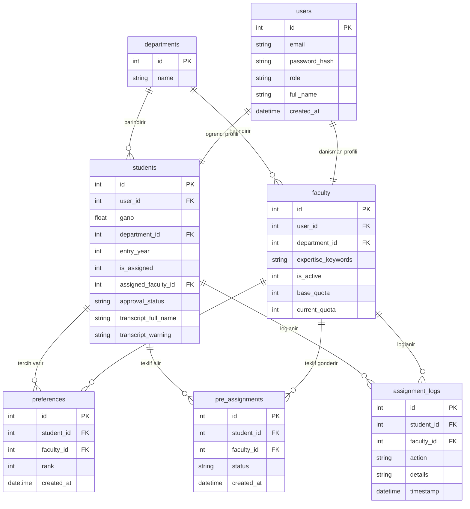
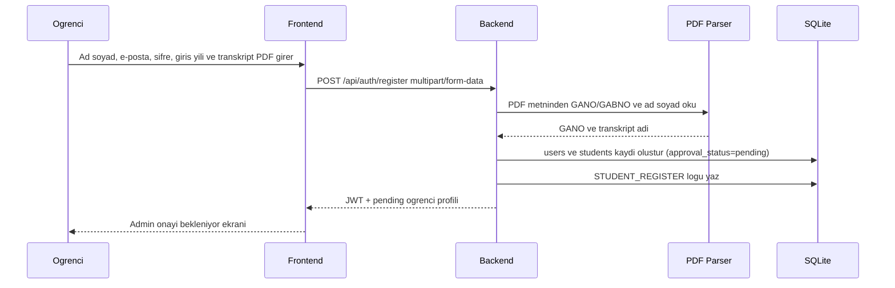
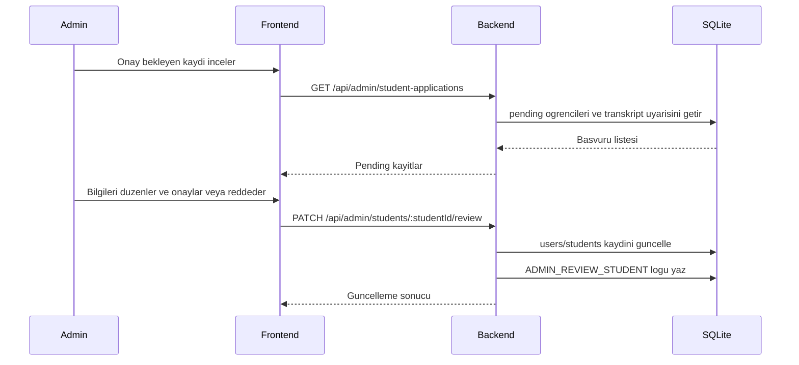
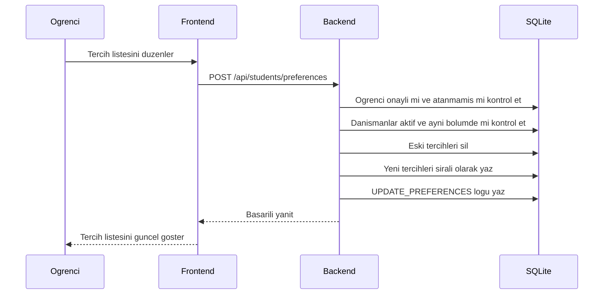
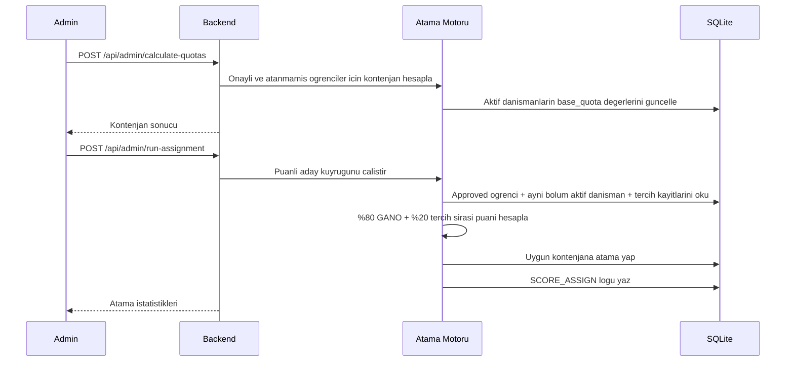
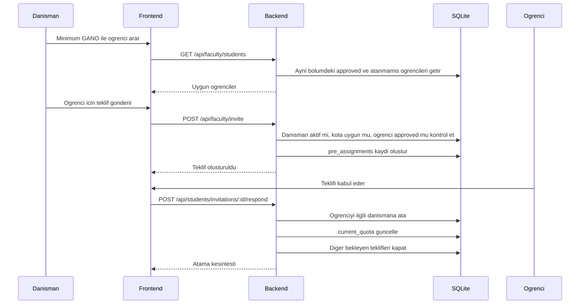

# Mimari ve Akis Dokumani

## Genel Bakis

Danisman Atama Sistemi, ogrencilerin kendi hesaplarini transkript PDF yukleyerek actigi,
adminin bu basvurulari onayladigi ve danisman atamalarinin puanli merkezi motorla
yapildigi bir web uygulamasidir. Sistem tek bolum mantigiyla calisir:
`Yapay Zeka ve Veri Muhendisligi`.

Atama motoru artik yalnizca GANO sirasi ile ilerlemez. Ogrencinin akademik basarisi ve
tercih sirasi birlikte kullanilir:

- `GANO_puani = (gano / 4) * 100`
- `tercih_puani`: ilk tercih `100`, son tercih `0`, aradaki tercihler dogrusal dagilir
- `toplam_puan = GANO_puani * 0.80 + tercih_puani * 0.20`

Dogrudan danisman teklifi kabul edilirse ogrenci merkezi yerlestirme sirasindan cikar.

## Temel Is Kurallari

- Public kayit endpointi yalnizca ogrenci olusturur; `role` alani kabul edilmez.
- Ogrenci kaydi `multipart/form-data` ile yapilir ve transkript PDF bellekte okunur.
- PDF metninde `GANO` veya `GABNO` etiketi aranir; bulunan deger `0-4` araliginda olmalidir.
- Transkriptte okunabilen ad soyad, formdaki ad soyad ile normalize edilerek karsilastirilir.
  Uyusmazlik varsa kayit reddedilmez; admin onay ekraninda uyari olarak gosterilir.
- Yeni ogrenciler `pending` durumunda baslar.
- Pending ogrenci giris yapabilir fakat danisman listesini goremez, tercih yapamaz, teklif yanitlayamaz
  ve merkezi atamaya dahil edilmez.
- Rejected ogrenci giris yapabilir fakat tercih/teklif/atama akislarina dahil edilmez.
- Approved ogrenci kendi bolumundeki aktif danismanlari gorur ve tercih listesi olusturabilir.
- Atanmis ogrenci tercih listesini degistiremez.
- Admin panelinden ogrenci olusturulmaz; admin yalnizca danisman olusturur ve ogrenci
  basvurularini onaylar, reddeder veya bilgilerini duzenler.
- Danismanlar yalnizca kendi bolumlerindeki onayli ve atanmamis ogrencileri gorebilir.
- Pasif danisman yeni teklif gonderemez ve merkezi atama havuzuna girmez.
- Manuel atama yalnizca onayli ogrencilere ve ayni bolumdeki aktif danismanlara yapilir.
- Merkezi atama, puanli aday kuyrugunu su sirayla siralar:
  toplam puan, GANO, tercih sirasi, ogrenci ID, danisman ID.
- Tercihlerle atanamayan onayli ogrenci varsa sistem ayni bolumde bos kontenjani olan aktif
  danismana fallback atama yapabilir.
- Atama loglarinda puan, GANO katkisi, tercih katkisi ve tercih sirasi saklanir.

## ER Diyagrami

## Sequence Diyagrami: Ogrenci Kaydi

## Sequence Diyagrami: Admin Ogrenci Onayi

## Sequence Diyagrami: Ogrenci Tercih Kaydi

## Sequence Diyagrami: Puanli Merkezi Atama

## Sequence Diyagrami: Danisman Dogrudan Teklif Akisi

## Operasyonel Notlar

- Veritabani uygulama acilisinda `schema.sql` ve `seed.sql` ile temiz ortamda olusturulabilir.
- Seed verisi admin ve danismanlardan olusur; demo ogrenci hesabi bulunmaz.
- Tek bolum kaydi seed icinde `Yapay Zeka ve Veri Muhendisligi` olarak tutulur.
- Gercek transkript dosyalari sistemde saklanmaz; PDF metni kayit sirasinda bellekte islenir.
- OCR veya fotograf tabanli transkript destegi bu surumun kapsami disindadir.
- Kullanici silme isleminde bagli tercih, teklif, atama ve log verileri kontrollu sekilde temizlenir.
